

# ❤️ MAC MENU BAR — GOLD EDITION
### A macOS-style menu bar for Windows — built with AutoIt
**Version 1.0.4.3 · Release 26-06-09**
© AndrianAngel — All rights reserved

---

## 📦 Download

| File | Description |
|------|-------------|
| `Mac_Menu_Bar_Gold_Edition_Release_26_06_09_FINAL_V1_0_4_3.exe` | 64-bit standalone executable — run directly, no install needed |
| `Mac_Menu_Bar_Gold_Edition_Release_26_06_09_FINAL_V1_0_4_3.zip` | Same executable packaged as a zip archive |
| `MyVDW.rmskin` | Rainmeter skin for Virtual Desktop integration |
| `MyVDW.zip` | Same Rainmeter skin packaged as a zip archive |
| `Icons.zip` | Icon pack — includes `a1.ico` for the top-left MyStart button |

---

| File | Description |
|------|-------------|
| `Mac_Menu_Bar_Gold_Edition_Release_26_06_09_FINAL_V1_0_4_3.exe` | Standalone 64-bit executable — run directly, no install needed |
| `Mac_Menu_Bar_Gold_Edition_Release_26_06_09_FINAL_V1_0_4_3.zip` | Archive containing the same 64-bit executable |

> Single instance enforced — only one copy runs at a time.

---

## 🛠️ Settings GUI

The settings panel is where you configure every aspect of the bar — appearance, behavior, menus, hotkeys, and more.

---

### 🔰 General & Jump To Paths

<table>
<tr>
<td width="50%">

**General**

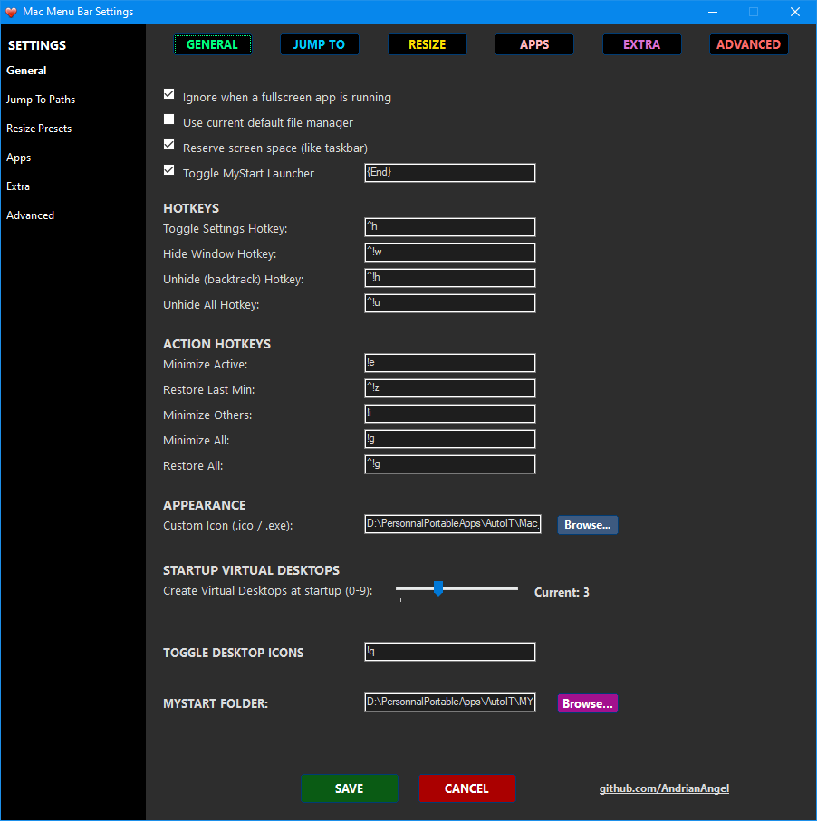

Control the bar height, font weight, startup behavior, reserved screen space (working area), bar visibility toggle hotkey, and the main icon path (`icons\mac.ico`).

</td>
<td width="50%">

**Jump To Paths**

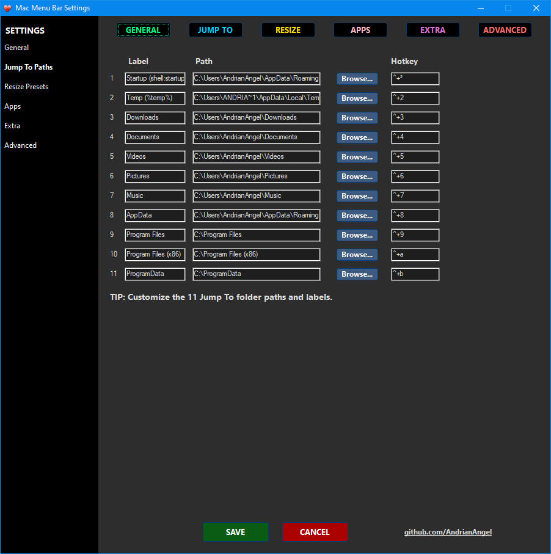

Configure up to 11 instant-access folder shortcuts (Startup, Temp, Downloads, Documents, Videos, Pictures, Music, AppData, Program Files, etc.) each with its own assignable hotkey (`Ctrl+Shift+1` through `Ctrl+Shift+B` by default).

</td>
</tr>
</table>

---

### 🔰 Resize Presets & Apps

<table>
<tr>
<td width="50%">

**Resize Presets**

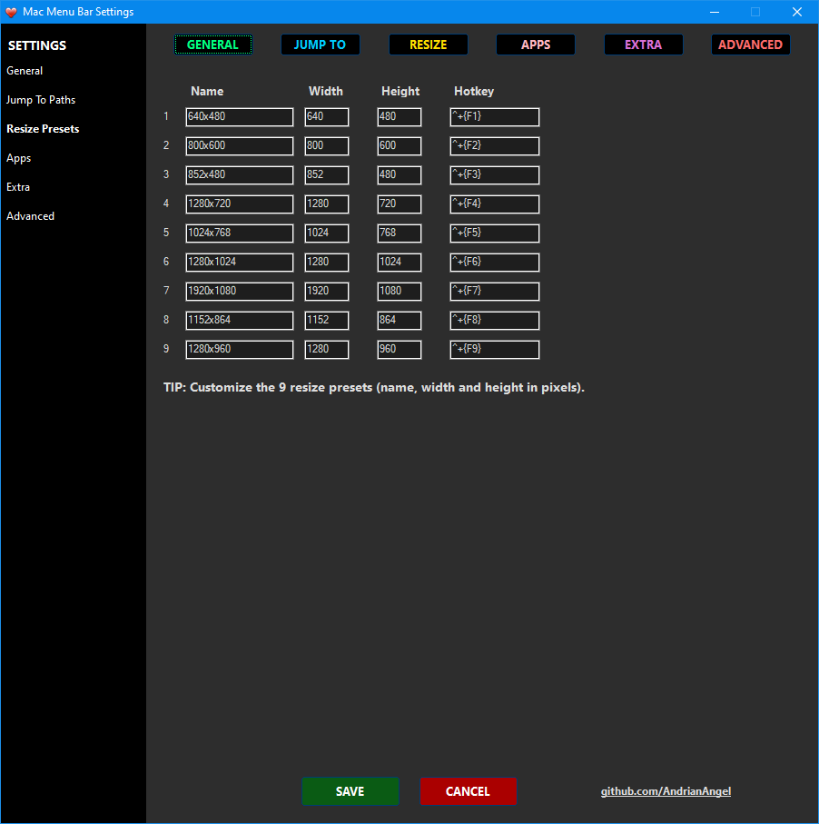

Define up to 9 window size presets (e.g. 640×480, 1280×720, 1920×1080) with custom hotkeys (`Ctrl+Shift+F1`–`F9` by default). Apply any preset instantly to the active window.

</td>
<td width="50%">

**Apps**

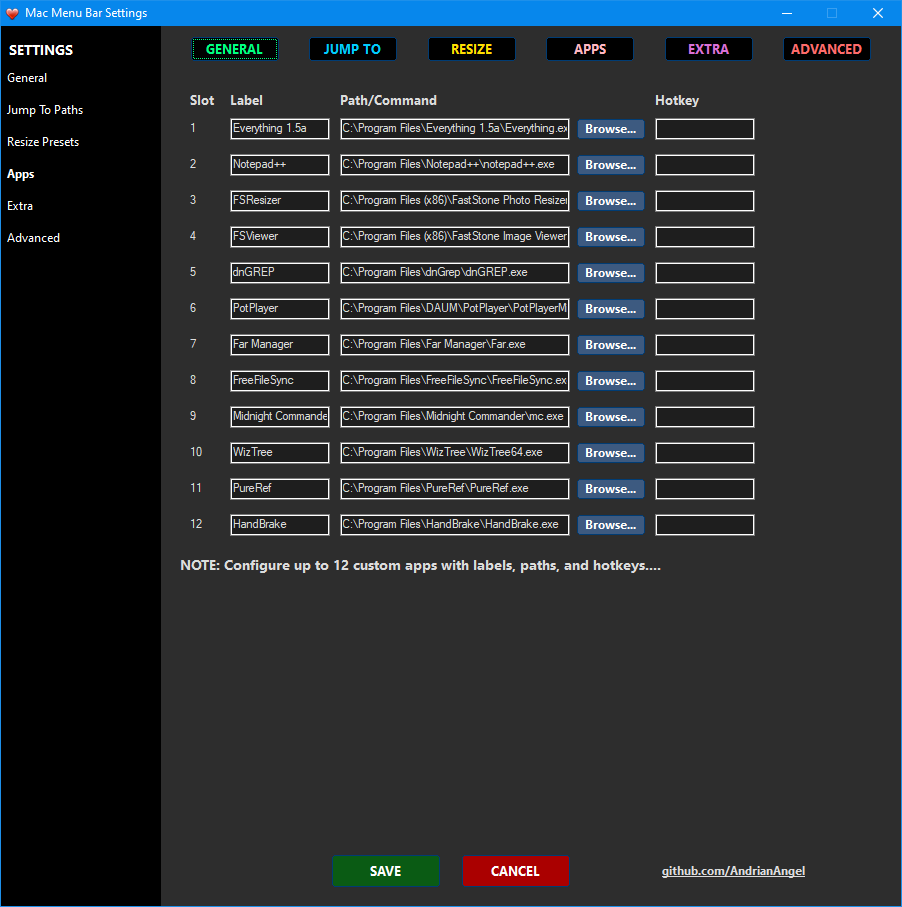

Assign up to 12 custom app shortcuts with a label, path/command, and hotkey. Launch your most-used apps directly from the bar's Apps menu.

</td>
</tr>
</table>

---

### 🔰 Extra & Advanced

<table>
<tr>
<td width="50%">

**Extra**

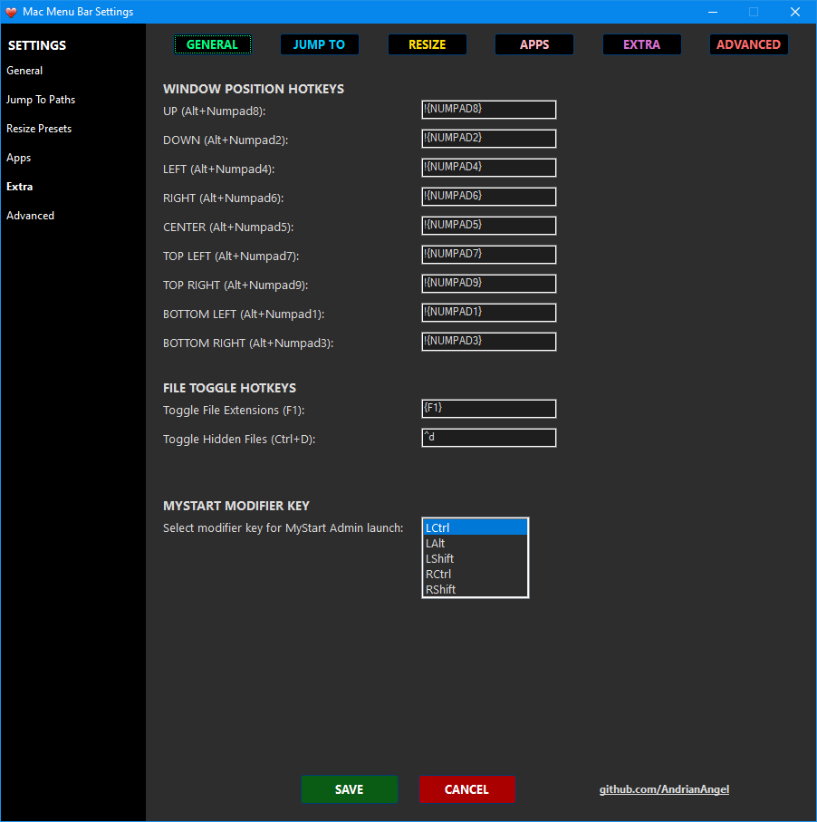

Additional hotkeys including the Settings shortcut (`Ctrl+H` by default), the desktop icons toggle (`Alt+Q`), and the hidden window manager shortcuts (`Ctrl+Alt+W` hide / `Ctrl+Alt+H` unhide one / `Ctrl+Alt+U` unhide all).

</td>
<td width="50%">

**Advanced**

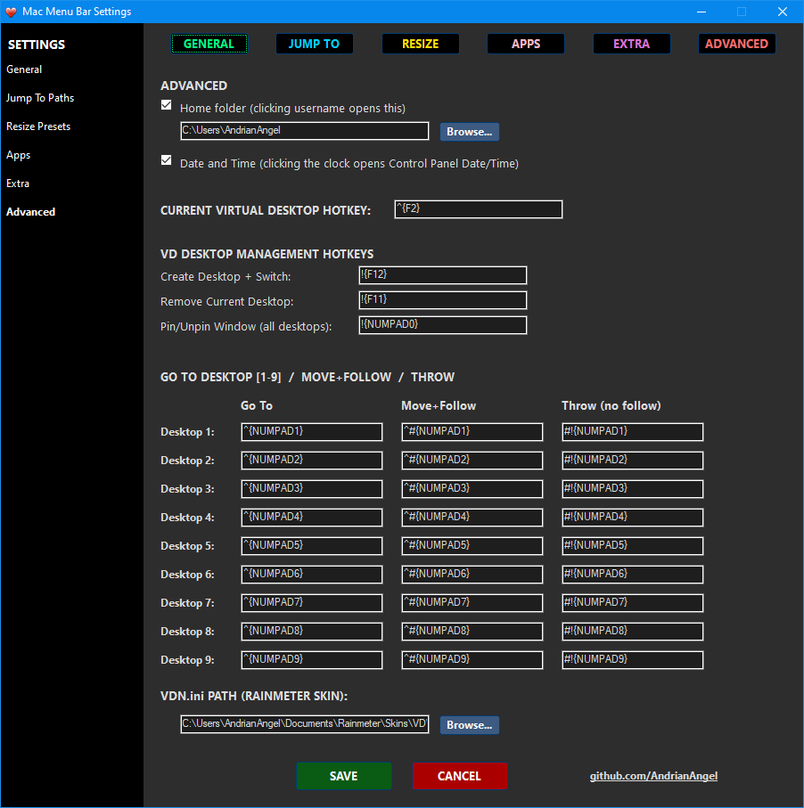

Fine-tune Virtual Desktop hotkeys, configure the Username display and Home Folder path, enable or disable the Date & Time widget, and manage the Custom App Name feature.

</td>
</tr>
</table>

---

## 🚩 Tray Menu & System

<table>
<tr>
<td width="50%">

**Tray Menu**

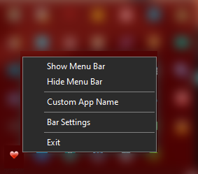

Right-click the system tray icon to access quick toggles, show/hide the bar, open settings, or exit the application.

</td>
<td width="50%">

**System Info**

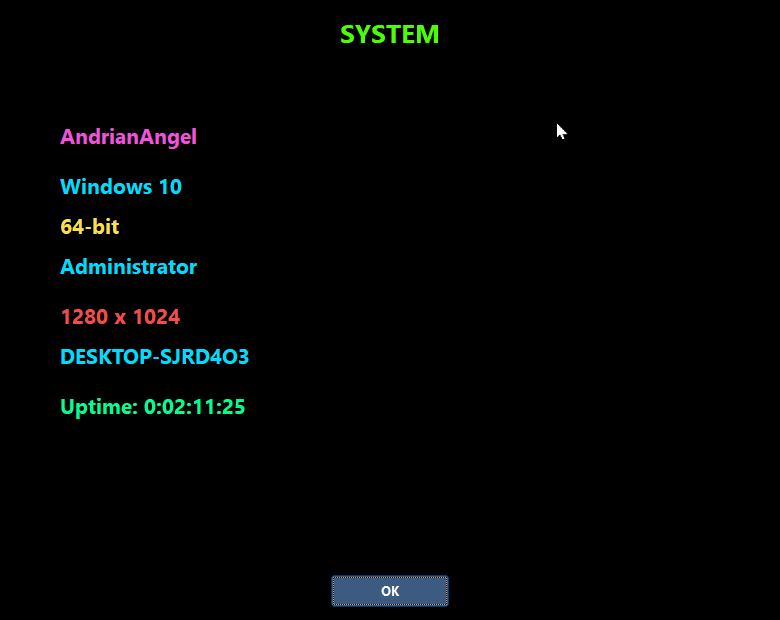

The About → System dialog shows live hardware and OS information: Windows version, build number, CPU, RAM, GPU, and disk usage — all pulled directly from the running system.

</td>
</tr>
</table>

---

## ⚔️ Main Bar

---

### 💎 MyStart (Start Menu)

<table>
<tr>
<td width="50%">

**MyStart Launcher**

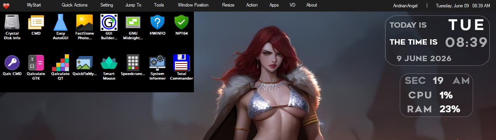

MyStart is a custom mini-launcher that opens on a hotkey (`End` key by default, held with `Left Ctrl`). It scans a configurable folder for `.lnk` shortcuts and displays up to 16 of them as icon tiles.

</td>
<td width="50%">

**MyStart — My Own Config**

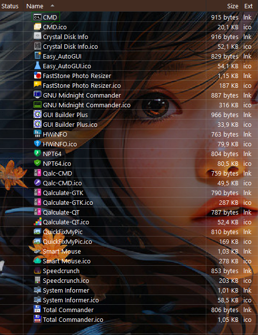

**Don't use the default Desktop folder.** Create a dedicated folder anywhere you like, fill it with your own `.lnk` shortcut files and custom `.ico` icons, then point MyStart at that folder in Settings. This gives you a clean, curated launcher completely separate from your Desktop clutter. The bar itself also uses `icons\a1.ico` as the clickable MyStart button — replace it with any icon you want.

</td>
</tr>
</table>

---

### 💎 App Name Menu & Quick Actions

<table>
<tr>
<td width="50%">

**App Name Menu**

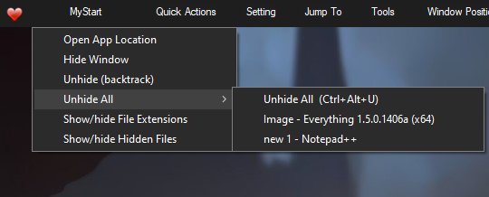

The leftmost button always shows the name of the currently active application. You can assign a **custom display name** to any process via the Custom App Name feature (`Ctrl+G` by default): map any `.exe` name to whatever label you want shown in the bar. The bar's own process is automatically registered as `"MyStart"`.

</td>
<td width="50%">

**Quick Actions Menu**

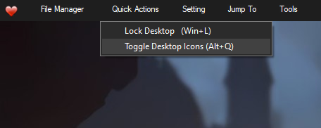

One-click access to the most common window operations without opening a submenu.

</td>
</tr>
</table>

---

### 💎 Settings Menu & Jump To Menu

<table>
<tr>
<td width="50%">

**Settings Menu**

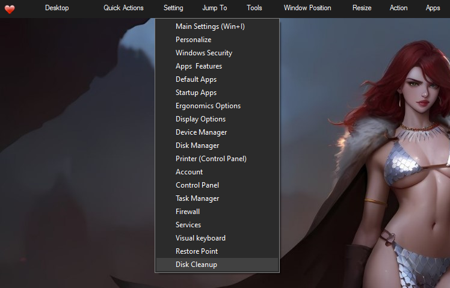

Direct links to 19 Windows system panels: Main Settings, Personalization, Windows Security, Apps & Features, Default Apps, Task Manager, Control Panel, Device Manager, Services, Firewall, Disk Cleanup, and more — all in one click.

</td>
<td width="50%">

**Jump To Menu**

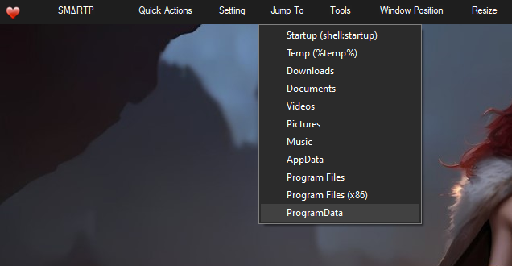

Instantly open any of your configured folders in Explorer. Fully customizable paths and hotkeys from the Settings GUI.

</td>
</tr>
</table>

---

### 💎 Tools Menu & Window Position Menu

<table>
<tr>
<td width="50%">

**Tools Menu**

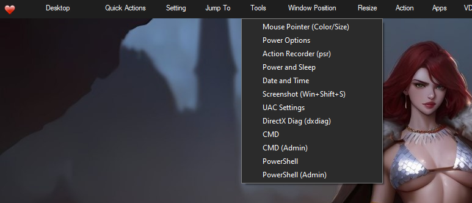

Built-in shortcuts to system utilities: Mouse Pointer settings, Power Options, Action Recorder (PSR), Power & Sleep, Date & Time, Screenshot (`Win+Shift+S`), UAC Settings, DirectX Diagnostic, CMD, CMD (Admin), PowerShell, and PowerShell (Admin).

</td>
<td width="50%">

**Window Position Menu**

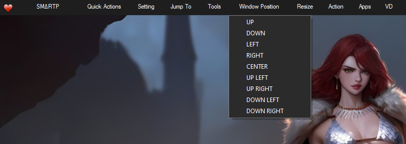

Snap the active window to any of 9 positions on screen: Up, Down, Left, Right, Center, and all four corners — each with its own assignable hotkey (`Alt+Numpad` by default).

</td>
</tr>
</table>

---

### 💎 Resize Menu & Action Menu

<table>
<tr>
<td width="50%">

**Resize Menu**

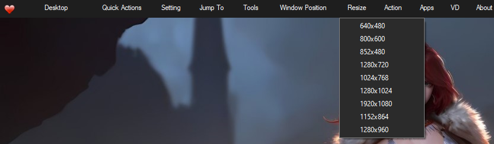

Apply any of your 9 configured size presets to the active window instantly, with hotkey support.

</td>
<td width="50%">

**Action Menu**

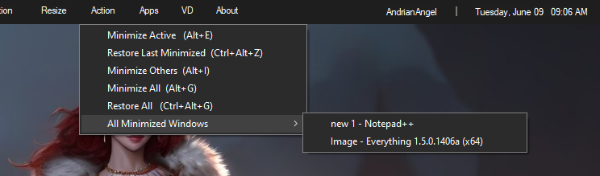

Minimize the active window, minimize all others, minimize everything, restore the last minimized window, or restore all — all with dedicated hotkeys (`Alt+E`, `Alt+I`, `Alt+G`, `Ctrl+Alt+Z`, `Ctrl+Alt+G`).

</td>
</tr>
</table>

---

### 💎 Apps Menu & VD Menu

<table>
<tr>
<td width="50%">

**Apps Menu**

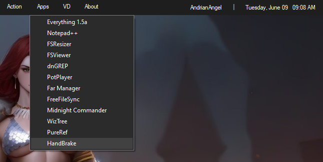

Launch any of your 12 configured applications directly from the bar, with hotkey support.

</td>
<td width="50%">

**VD Menu**

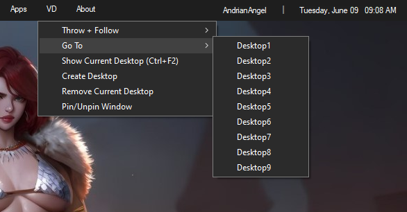

Full Windows Virtual Desktop management: go to a desktop (`Ctrl+Numpad1–9`), throw the active window and follow (`Ctrl+Win+Numpad1–9`), throw without following (`Win+Alt+Numpad1–9`), create a new desktop (`Alt+F12`), remove the current one (`Alt+F11`), pin/unpin the active window (`Alt+Numpad0`), and integrate with Rainmeter VDN skins.

</td>
</tr>
</table>

---

### 💎 About Menu

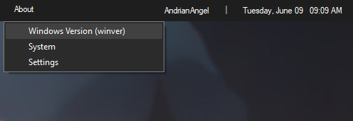

Displays version info, credits, and links. Also opens the live System Info dialog.

---

### 📌 Username & Date and Time

<table>
<tr>
<td width="50%">

**Username**

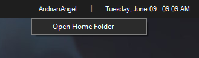

Displays the current Windows username on the right side of the bar. Clicking it opens the configured Home Folder in Explorer (customizable path in Advanced settings).

</td>
<td width="50%">

**Date and Time**

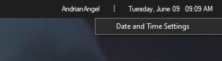

Live clock displayed on the bar's right side. Can be enabled/disabled from Advanced settings.

</td>
</tr>
</table>

---

## 🎦 Watch Demo

---

### ✅ All Settings & Help Overview

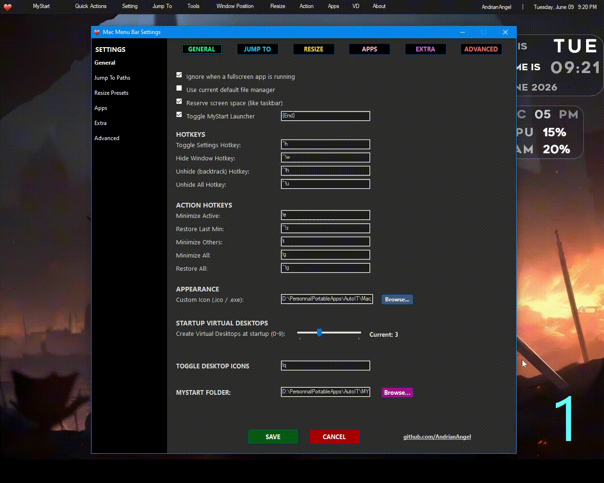

---

### ✅ MyStart In Action + Hide Window

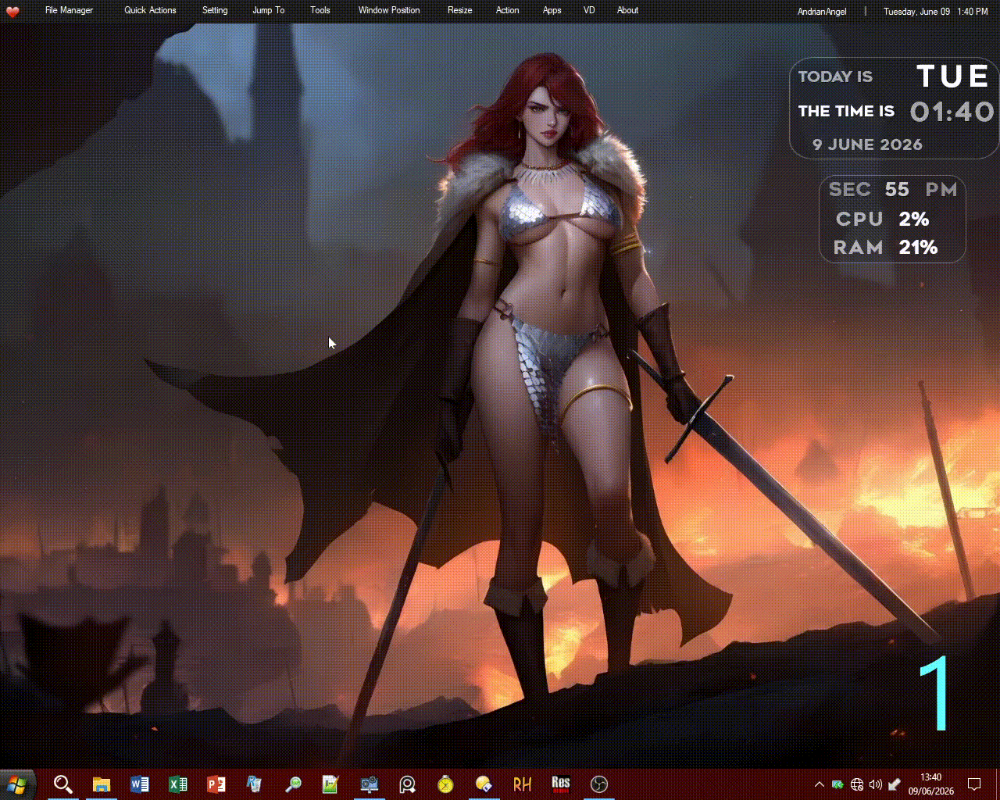

---

### ✅ Settings + Jump To + Tools + Apps In Action

---

### ✅ Action Menu — Minimize In Action

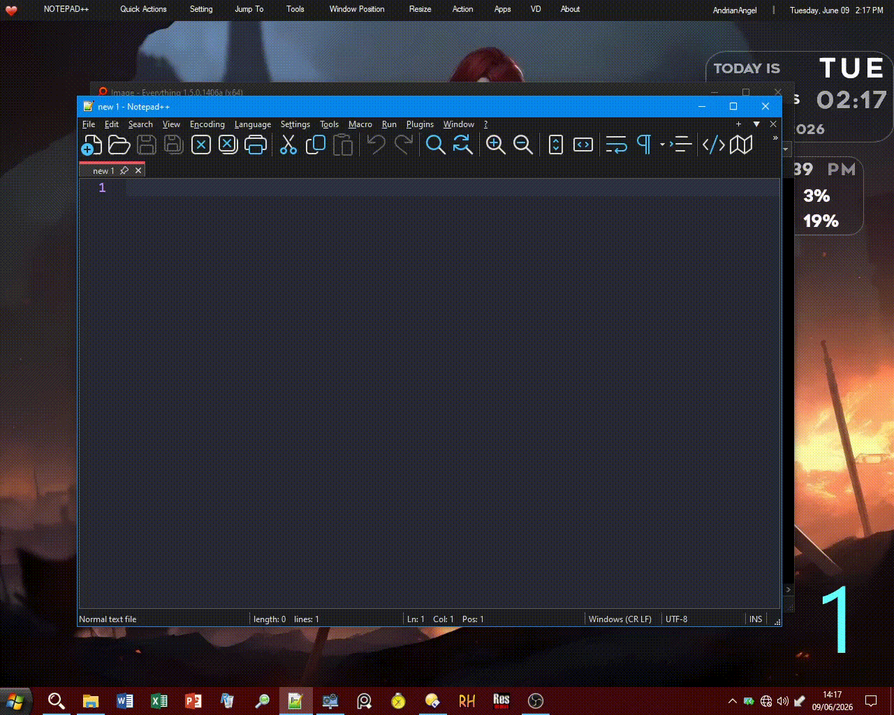

---

### ✅ About Menu · System · Username · Date and Time

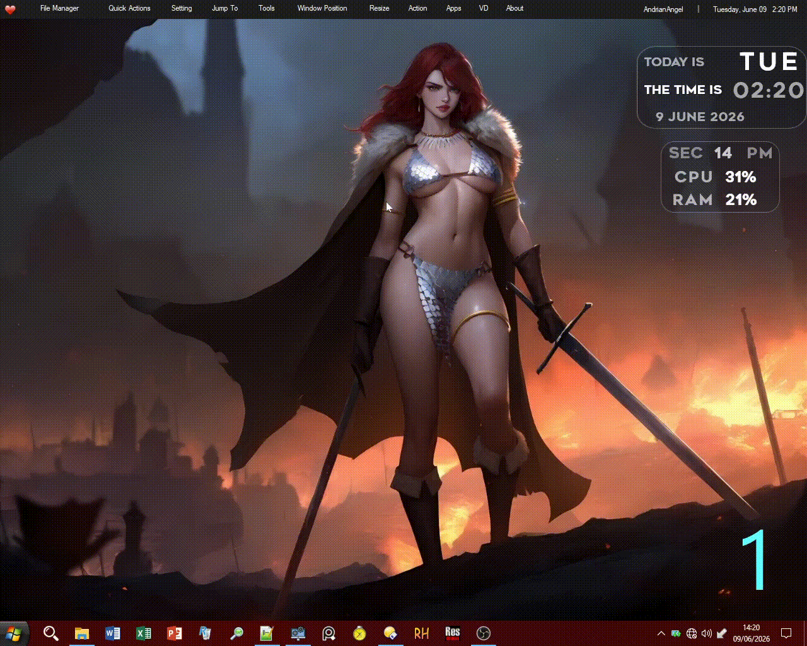

---

### ✅ Virtual Desktop (Throw Follow / Go To / Throw No Follow / Rainmeter / Flyout)

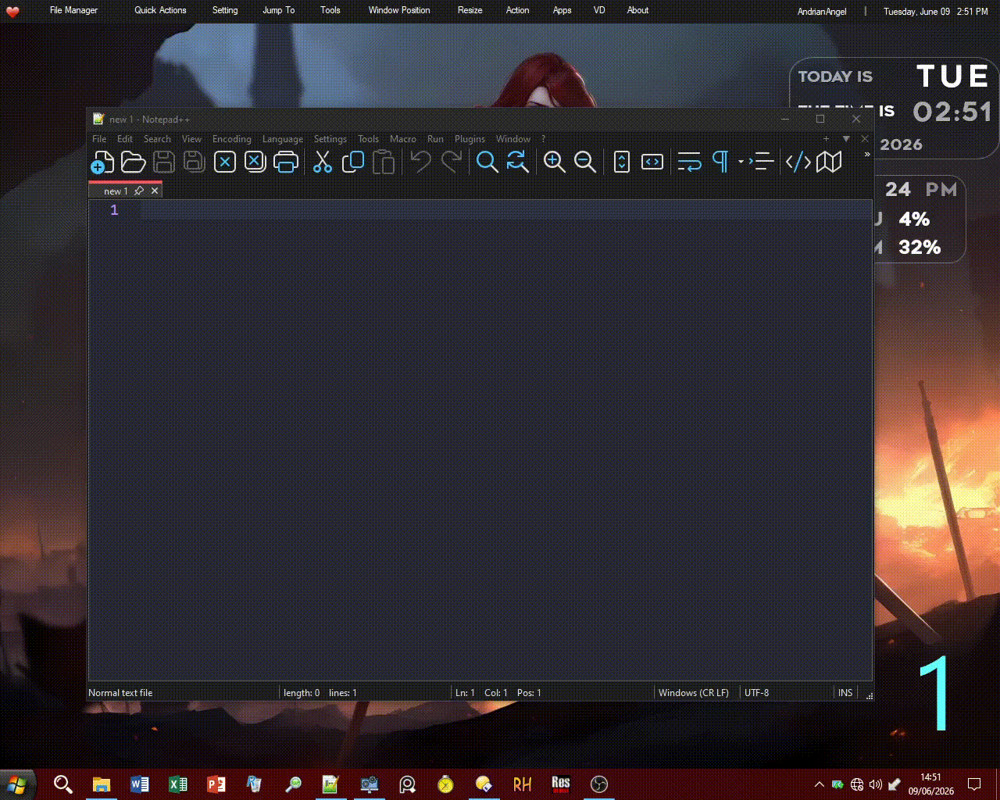

---

### ✅ Toggle Desktop Icons (Fade In / Fade Out)

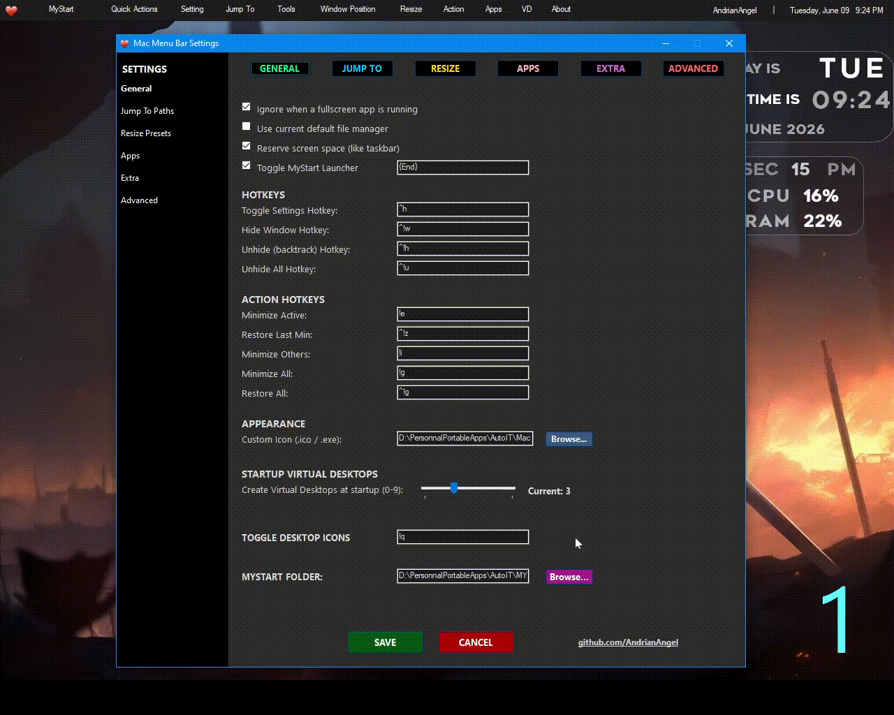

---

### 🔖 What's New in v1.0.4.3
- Gold Edition final release
- Full Virtual Desktop engine with Rainmeter VDN integration
- MyStart custom launcher with custom folder, `.lnk` + `.ico` support
- Custom App Name mapping per `.exe`
- Toggle Desktop Icons with fade in/out
- Hidden window stack manager
- Dark mode settings GUI
- DPI-aware rendering

---

© AndrianAngel — All rights reserved

